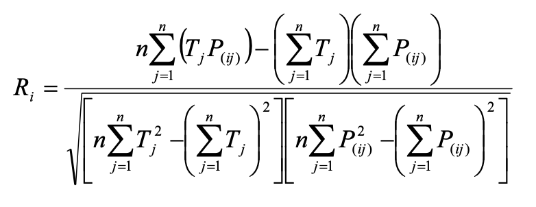

# The Base Gene Expression Algorithm 

- The fundamental steeps of gene expression algorithm (GEA) are schematically represented in the following diagram: 

- Process begins with random generation of chromosomes of a certain number of individuals (called Initial Population)
- Then, these chromosomes are expressed, and the fitness of each individual is evaluated against a set of fitness cases (also called selection environment)
    - Fitness cases can be seen as inputs to a problem
- Individuals are selected according to fitness (their performance in that particular environment), to reproduce with modifications, leaving progeny with new traits
- This individuals will, in turn, follow the same process of expression, confrontation of environment, selection, reproduction with modifications. 
- The process is repeated for a certain number of generations, or until a good solution is found 

This chapter explores this steps in depth. The goal is to understand the logistics of GEA, but also to understand why and how populations of computer programs become better and better as they evolve. 

## Population of Individuals

- An initial population must be created in order to get things started 
- Subsequent populations are descendants via genetic modification, of this initial (or founder) population
- In GEP, it is only necessary to generate random simple chromosomal structures to get things going 
    - Random works, as any genome is valid, due to the properties we saw before
- This is a trivial task, and one of the great advantages of this technique

- Then, for each problem, we must choose the set of terminals used to create the chromosomes and the set of functions we believe to be appropriate to solve the problem. 
    - The set of terminals represents the variables and constants that the problem will use 
- We must also choose the length of each gene, the number of genes per chromosome, and how they interact with one another
- Finally, we must provide a set of fitness cases (selection environment) that will help us measure the fitness of each individual, and choose which individuals to reproduce

### Creation of Initial Population 

- Chromosomes of individuals on initial population are randomly generated using symbols representing functions and terminals chosen
    - Remember they will always be valid if we fill head with functions and terminals, and tail with just terminals
- Usually, this individuals are not very good, but they are all we need to get started, as evolution will take care of the rest
- Problem with random generation of initial population is that, sometimes, specially with small populations or fitness cases not broad enough, or tight fitness function, it might happen that none of the initial chromosomes encoded viable individuals (due to their fitness), and the run is aborted.  
- To avoid this issue, we can introduce a start up control. 
    - This control is set by default to one viable individual
    - This does not hinder the evolutionary process, as GEP populations can evolve efficiently even with just one viable founder  
    - This control, with cloning of best individual prevents the existence of failed runs in GEP
- If all individuals of initial population happens to have zero fitness, another initial population is randomly generated, until at least one viable individual is created and evolutionary process can resume

### Subsequent Generations and Elitism

- From generation to generation, the best individual (or one of the best) is replicated unchanged into the next generation. 
    - If more than one have the same best fitness, the last one is chosen to become a clone
- The cloning the best (simple elitism), guarantees that at least one descendant will be viable (in problems where selection environment is the same in all generations)
- Elitism has a big advantage on high modification rates, as we don't have the risk of causing a mass extinction
- In GEP, populations are always evolving at high creative rates in creative periods 
    - AI gives the opportunity to have much faster evolution and in constant turmoil, allowing the discovery of good solutions in record time
    - This is in really different in nature, as adaptation and evolution happens slowly and smoothly

## Fitness Functions and the Selection Environment 

- Fitness function and selection environments are the two faces of fitness and they are intricately connected
    - Fitness of an individual is relative to a particular environment and to the measure (fitness function) used to evaluate them 
- Success of a problem not only depends on the fitness function, but also on quality of selection environment 

### The Selection Environment 

- Selection environment is the input to the evolutionary system
- Models will depend greatly on the quality of the environment we choose for them to blossom 
- First requirement is a set of fitness cases representative of the problem at hand
- Second consists of a all-balanced set, to avoid the creation of models that can only solve a partial marginal aspect of the overall problem
- Even with a good data set, it is possible to get stuck in local optima, and individuals might need a little help
- To do this, we can change our fitness function
    - This changes the fitness landscape, and a peak can become a valley, leading to better solutions
- It is handy to have more than one fitness function at our disposal to try a few of them on a problem 

### Fitness Functions for Symbolic Regression

- An important application of evolutionary computation is symbolic regression, where the goal is to find a model that is good at numeric prediction (will perform well for all fitness cases)
- There are several measures to evaluate how good these models are
    - Some are based on the absolute error between predicted and target values
    - Others are based on relative error
    - Others are based on statistical indexes that measure correlation between values
- Depending on the problem, any fitness function could perform better or worse than others, but some functions like mean squared error or R-square are universal, and can be used to evolve very good models in all kinds of problems
- Remember, absolute error is `abs(p - t)` and relative error is `abs((p - t) / t)`, where `p` is predicted value, and `t` is target value

#### Number of Hits

- Favors Models that perform well for all fitness cases within a certain error (absolute or relative)
- Formally, fitness `f(i, j)` of an individual program `i` for fitness case `j` is evaluated by:
    - `If err(i, j) <= p, then f(i, j) = 1, else f(i, j) = 0`
    - where `p` is precision error, and `err(i, j)` is error on individual program `i` for test case `j` 

#### Precision and Selection Range

- Idea of a selection range and a precision. 
    - Selection range is used as a limit for selection to operate
    - Precision is the limit for improvement
- Formally, fitness `f(i)` of an individual program `i` is expressed by:
    - `f(i) = sum_j_from_1_to_n(R - err(i, j))`
    - Where `R` is the selection range and `err(i, j)` is error for test case `j` with individual `i`
    - The error term is called the precision `p`

#### Mean Squared Error

- Based on standard mean squared error
- Formally, mean squared error `E(i)` of an individual program `i` is:
    - `E(i) = 1 / n * sum_j_from_1_to_n(err(i, j)^2)`
- As it stands, `E(i)` cannot be used directly to measure fitness, as fitness must increase with efficiency (in this case it is reduced).
- Thus, to evaluate fitness `f(i)` of an individual `i`, the following equation is used
    - `f(i) = 1000 * 1 / (1 + E(i))`
    - It ranges from 0 to 1000, with 1000 being the ideal 

#### R-Square

- Based on standard R-square, that returns square of Pearson product moment correlation coefficient
    - This coefficient ranges from -1 to 1, and reflects the extent of a linear relationship between predicted and target values. 1 means perfect correlation, -1 is a perfect negative correlation. 0 means no correlation
- Formally, the Pearson product moment correlation coefficient `R(i)` of an individual program `i` is evaluated by:
- 

- Where `P(i, j)` is predicted value by individual `i` for fitness case `j`, and `T(j)` is target value for fitness case `j`
- Then, fitness `f(i)` of individual `I` would be
    - `f(i) = 1000 * R(i)^2`

### Fitness Functions for Classification and Logic Synthesis

- Classification and logic synthesis are different, but share a similarity: Their predictables or dependent variables are both binary, so they can use same kind of fitness functions
- Usually, there are four different outcomes of a single prediction for a two class problem
    - False Positive (FP)
    - False Negative (FN)
    - True Positive (TP)
    - True Negative (TN)
- Usually FN and FP will have different costs, and TP and TN will have different benefits

#### Number of Hits

- Corresponds tu number of samples correctly classified
- Formally, fitness `f(i)` of an individual program `i` is evaluated by:
    - `f(i) = h`
    - where `h` is the number of fitness cases correctly evaluated
- Sometimes a more sophisticated function is needed, as it is easy to get simple programs with high fitness, even if they are not really good predictors

#### Hits With Penalty

- Designed to avoid dissemination of useless programs that trap system in local optima
- To do that, we can follow the following strategy
    - For each program `i`, both number of `TP(i)` and `TN(i)` are evaluated 
    - As long as either `TP(i)` or `TN(i)` remain equal to zero, this model will be considered unviable and it won't be selected to reproduce
- Formally, the fitness `f(i)` of an individual program `i` is evaluated by:
    - `IF (TP(i) = 0 or TN(I) = 0) THEN f(i) = 0; ELSE f(i) = h`
    - where `h` is number of fitness cases correctly evaluate   

#### Sensitivity / Specificity 

- Based on both the sensitivity and specificity indicators, commonly used in the medical field 
    - Sensitivity reflects the probability of diagnostic test finding disease among those who have the disease, or people with disease with a positive result
    - Specificity reflects the probability of diagnostic test finding no disease among those who don not have the disease or the proportion of people free of disease with a negative test 
- Formally (and more clearly) the sensitivity `SE(i)` of a program `i` is evaluated by:
    - `SE(i) = TP(i) / (TP(i) + FN(i))`
    - In other words, of all real positives, what percentage was correct
- The specificity `SP(i)` is evaluated by:
    - `SP(i) = TN(i) / (TN(i) + FP(i))`
    - In other words, of all real negatives, what percentage was correct 
- By multiplying both indicators, one focus the discovery of models with high sensitivity and specificity 
- It is useful when we have highly unbalanced training sets (excess of positive  or negative instances)
- Sensitivity/Specificity `SS(i)` of an individual program `i` is: 
    - `SS(i) = SE(i) * SP(i)`
- And to evaluate fitness `f(i)` of an individual program `i` is:
    - `f(i) = 1000 * SS(i)`

#### Positive/Negative Predictive Value 

- Based both on positive predictive value (PPV) and negative predictive value (NPV) indicators. This indicators are also commonly used in medicine:
    - PPV reflects the percentage of people with a positive diagnostic test result who actually have the disease
    - NPV reflects the percentage of people with a negative diagnostic test who do not have the disease
- More formally, `PPV(i)` of an individual `i` is evaluated by:
    - `PPV(i) = TP(i) / (TP(i) + FP(i)) where TP(i) + FP(i) is not 0`
    - In other words, of all True guesses, what percentage was correct
- And `NPV(i)` is evaluated by: 
    - `NPV(i) = TN(i) / (TN(i) + FN(i)) where TN(i) + FN(i) is not 0`
    - In other words, of all False guesses, what percentage was correct
- Again, by multiplying both we make sure model takes both into account
    - `PN(i) = PPV(i) * NPV(i)`
And for evaluating fitness `f(i)` of an individual program `i`, we get:
    - `f(i) = 1000 * PN(i)`

### Selection Mechanism 
- In GEP, individuals are selected according to fitness by roulette-wheel sampling
    - Each individual receives a slice of the roulette-wheel proportional to its fitness
    - Roulette is spun as many times as there are individuals in the population, so that population size is maintained 
    - The bigger the slice, the higher the probability of being selected
- This kind of selection together with simple elitism is used through the book 
- Sometimes best individuals might be lost and mediocre ones are passed on, but this is not bad, as good individuals might be created again and be more fortunate, and descendants of mediocre individuals won't necessarily be mediocre, and adaptation goes on, and perhaps through an unexpected path, we might reach a global optimum
- Nonetheless, due to the cloning of the best individual of each generation, the survival and reproduction of the best is guaranteed, so the best trait is never lost, and it is in continuous improvement
- There are other selection schemes, but most popular are roulette-wheel, deterministic, tournament selection, between others. 
- In GEP it doesn't really matter, the important part is to have a good genotype/phenotype system with good genetic operators 

 ## Reproduction with Modification 

- According to fitness and luck, individuals are selected to reproduce with modification
- This creates the fundamental genetic diversity that allows adaptation in the long run 
- In GEP, all modifications occur after the replication of the genome, in an orderly fashion, starting with replication, then mutation, inversion, transposition, and finally recombination 
    - It's important to note that the order in which the genome is modified is not important no the final outcome 
- Replication copies all selected genomes exactly the same
- All remaining operators randomly pick up chromosomes to be subjected with certain modifications. And except for mutation, each operator is not allowed to modify a chromosome more than once
- In GEP, a chromosome might be randomly chosen to be modified by more than one modification operator during its reproduction. This might create new population very different from the old one 
- Presented below, are the most commonly used genetic operators

### Replication and Selection 
- Most uninteresting operator of all, as it contributes nothing to genetic variation
- Together with selection, it can create genetic drift, and with modifications, it allows adaptation and evolution
- Selection operator chooses individuals to be reproduced according to their fitnesses and luck of roulette 
    - The higher the fitness, the higher the probability of leaving offspring
- Replication copies exactly the chromosomes of the individuals picked up by the selection operator  

### Mutation 

- Mutation is efficient, as it has a lot of modification power 
- With mutation, populations adapt very efficiently, allowing evolution of good solutions to virtually all problems 
- Needs a mutation rate `p(m)`
    - Author usually uses a rate equivalent to two one point mutations per chromosome 
    - For example, a chromosome of length 14 might have a `p(m) = 2/14 = 0.143`
- GEP allows mutations anywhere in the chromosome, but structural organization must be preserved
    - In head, any symbol can change into another (function or terminal), and in tails, terminals can change only into terminals 
- GEP point mutation is totally unconstrained, any function without concern for number of arguments, terminals, anything   
- Point mutations can have a deep effect, changing drastically the sub-ETs, or can have a neutral change that might induce a change in the future 
- Remember this is one of main differences of GEP to other genetics algorithms. There are no constrains in type of mutation and number of mutations, as it is always valid. The algorithm explores freely

###  Inversion

- Modifications bound to make a big impact occur usually in the heads of genes
- Therefore, inversion operator is restricted to that region 
- Any sequence might be randomly selected and inverted 
- As we just work with the head, inversions are always valid (no functions will go to the tail), and we can freely do the operations 
- Inversion randomly chooses a chromosome, a gene in it, and a start and termination point of the sequence that will be inverted 
- Usually, a small inversion rate `p(i)` of 0.1 is used, as this operator is rarely used as the only source of genetic variation 
- Inversion can cause macro mutations, as it can change the sub-ET completely. This is not bad, they are in fact essential to drive evolution into other very distant peaks 

### Transposition and Insertion Sequence Elements

- Transposable elements of GEP are fragments of the genome that can be activated and jump to another place in chromosome
- There are three kinds of transposable elements in GEP
    - Short fragments with either a function or terminal in the first position that transpose to the head of genes, except the root (insertion sequence elements, or IS elements)
    - Short fragments with a function in the first position that transpose to the root of genes (root IS elements, or RIS elements)
    - Entire genes that transpose to the beginning of chromosomes 
- No need to be cautions when designing genetic operators, as any modification (even the most disruptive) is capable of finding very good solutions very efficiently

#### Transposition of IS elements

- Any sequence in the genome can become an IS element, and these elements are randomly chosen throughout the chromosome 
- The transposon is then copied at the place of origin and the copy is afterwards inserted at a randomly chosen point in the head of the gene (except the start position) 
- Transposition operator randomly chooses the chromosome, the start and termination point of the IS element, and the target site. 
- Typically, a small IS transposition rate `p(is)` of 0.1 is used, as this operator is rarely used as the only source of genetic variation 
- Selected sequence is activated and jumps to the insertion site, and a sequence with as many symbols as the IS element is deleted at the end of the head, to keep structural organization of chromosomes

#### Root Transposition 

- All RIS elements start with a function, so we choose a random point and scan until a function is found. This function becomes the first position of the RIS element
    - If no functions are found, operator does nothing 
- Transposition operator chooses a random chromosome and gene, and start and termination points of the RIS element
- Typically, a root transposition rate `p(ris)` of 0.1 is used 
- As with IS, in RIS we delete a sequence with the same length at the end of the head of the gene modified to keep structure

#### Gene Transposition 

- In gene transposition an entire gene works as a transposon, and transposes itself to the beginning of the chromosome
- In contrast to other forms (IS and RIS), in gene transposition, the genes is deleted at the place of origin, to maintain the length of the chromosome 
- It shuffles genes, and when sub-ETs are linked with non-commutative functions, the order matters and gene transposition becomes a macromutator 
- Only transposition can move genes around in a chromosome 
- Needs other operations, as it can't create new genes, just move around existing ones 

### Recombination   

- GEP uses three kinds of recombination 
    - One-point recombination 
    - Two-point recombination
    - Gene recombination 
- In all types, two chromosomes are randomly chosen and paired to exchange some material between them, resulting in formation of two new individuals
- When used together with transposition, it is capable of duplicating genes, which is very important for an efficient and innovative evolution

#### One-point Recombination

- Parent chromosomes are paired side by side and split up ay exactly the same point
- Material downstream of recombination point is afterwards exchanged between the two chromosomes
- In GEP, a recombination always involves two parents and forms two new individuals 

#### Two-point Recombination

- Parent chromosomes are paired side by side and two points are randomly chosen by which both chromosomes are split
- The material between recombination points is then exchanged between chromosomes
- More disruptive than one-point, as it recombines genetic material more thoroughly 
- One and two-point tend to homogenize populations

#### Gene Recombination

- Entire genes are exchange between two parent chromosomes, forming two new daughter chromosomes containing genes from both parents
- Randomly chooses two parent chromosomes and gene to be exchanged 
- Typically a small gene recombination rate `p(gr)` of 0.3 is used 

## Solving a Problem 
- Choose the fitness function
- Choose terminals and functions 
- Choose chromosomal architecture
    - length of head and number of genes
- Choose linking function 
- Choose set of genetic operators and their rates

