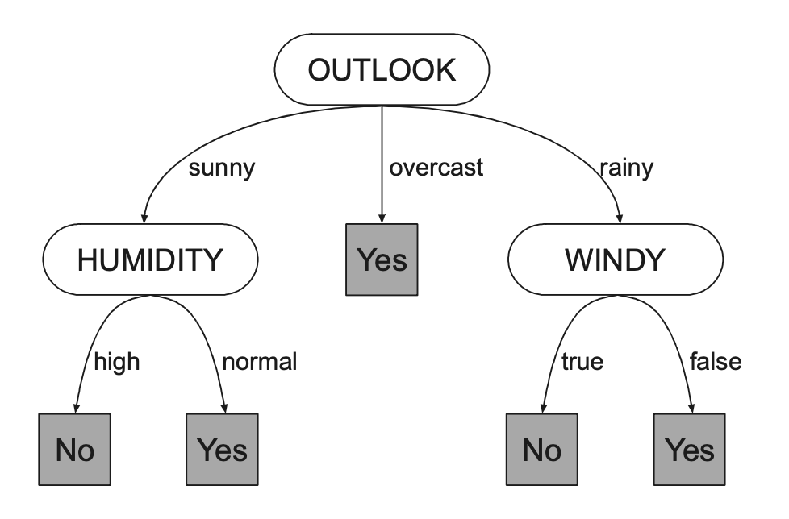
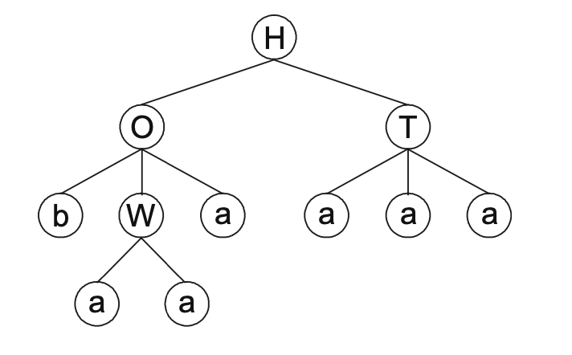
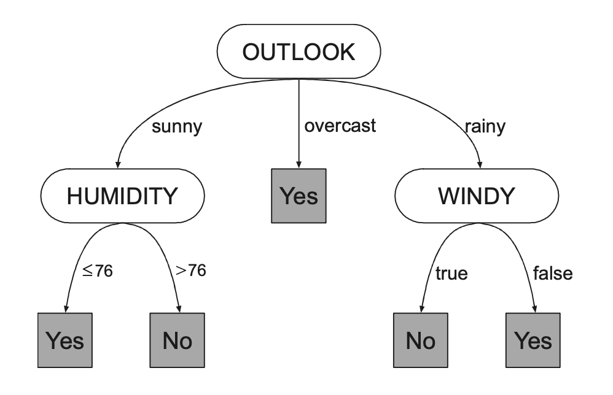
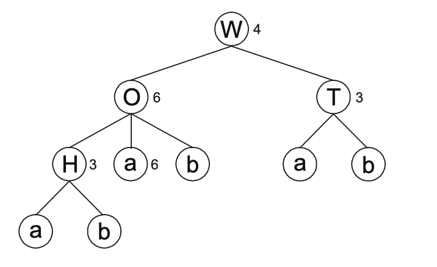

# Decision Tree Induction 

- Decision Tree induction is extremely popular in data mining 
    - Popular approaches involve divide and conquer to select attributes at the root, and make the same decision for every other node in the tree
- GEP can be used to design decision trees
    - It has the advantage that all decisions concerning tree growth are made by the algorithm and its evolution itself 
- There are two types of decision trees
    - First one is simplest and used to indice decision trees with nominal attributes. 
    - Second one has nominal and numeric attributes (mixed), but it is considerably more complicated and a more sophisticated method is required to grow the trees 
- This aspect is also true on GEP, and two algorithms were developed to deal with both types of trees 
    - Evolvable decision trees (`EDT`)
        - Induces decision trees with nominal attributes 
    - Evolvable decision trees with random numerical constants (`EDT-RNC`)
        - Develop for handling numerical attributes, but it can handle all kinds of attributes (any combination of nominal/numerical)

## Decision Trees with Nominal Attributes

- Describing data using decision trees (DTs) is easy on the eye and an excellent way of understanding data
- There is a famous toy dataset in DT induction, that wants to know if weather conditions are suitable for playing tennis 
- There are four attributes, each with nominal values
    - `OUTLOOK` can be sunny, overcast or rainy
    - `TEMPERATURE` can be hot, mild or cold
    - `HUMIDITY` can be high or normal
    - `WINDY` can be true or false
- The decision is wether to play or not, depending on values of the attributes
- An example DT for this dataset could be as follows
- 

- Classification rules from a DT can be inferred from running all paths from top node to leaf nodes 
- Let's see how DTs with nominal attributes can be induced with GEP

### Architecture 

- GEP can be used to induce DTs by dealing with attributes as if they were functions, and leaf nodes as terminals 
- On example above, attribute set `A` will consist of OUTLOOK, TEMPERATURE, HUMIDITY and WINDY, which can be represented as `O`, `T`, `H` and `W`, giving `A = {O, T, H, W}`
- Each of these attributes has an associated arity (# of branches `n`) that will determine their growth and ultimately, the growth of the tree. 
    - Here O and T split in three, T and W into two
- Terminal set will consist in this case of `Yes` and `No`, the different outcomes of the class, and each can be represented respectively as `a` and `b`, giving `T = {a, b}`
- Genes will also have head/tail with head containing attributes and terminals, and tail containing only terminals, to ensure all trees created by GEP are valid 
    - Tail size is also dictated by head size `h` and max number of branches 
    - `t = h * (n_max - 1) + 1`
- For our toy problem we have `n_max = 3`, and a head size `h = 5` would have a tail of size `t = 11`, and gene size `g = 16` (h + t)
- A gane could look as the following 
    - `HOTbWaaaaaabbbbb` 
- The expression is done exactly as in GEP, giving the following DT
    - 

- This simplified DT is a conventional DT, with all branches labelled in order
- Process of DT induction starts as usual, with a random initial population, then expression and fitness evaluation against a training set, and reproduction with modification
    - Modification mechanisms are exactly the same that apply in a unigenic system (mutation, inversion, IS, etc)
- Nothing but usual tricks of evolution are used on designing GEP DTs

### A Simple Problem with Nominal Attributes 

- Using our toy tennis problem, we can see how DTs learn 
- Using GEP in the experiment, the system found a perfect solution in generation 5, using number of hits as the fitness function 
- It used same evolutionary mechanisms as normal GEP, but a small modification on mutation and inversion was made, so that no terminals end up at the root, as this tree would be useless 

## Decision Trees With Numeric/Mixed Attributes 

-  Inducing conventional DTs with numeric attributes is considerably more complex than inducing DTs with nominal attributes, because there are many more ways of splitting data, and trees can get messy very quickly
- GEP handles numeric attributes aplomb and is not affected by messiness 
- We consider a different version of play tennis toy dataset, in which two attributes are numeric (TEMPERATURE and HUMIDITY)
- An example of a DT with numeric attributes is shown below
- 

- To implement this decision trees in GEP, we need a way to encode and fine-tune constants (as constant 76 in the example), that are required by numeric attributes to split data

### Architecture 

- GEP DTs with numeric attributes explore a very similar architecture to the one used for polynomial induction
- We use a `Dc` domain with same size as the head, to encode constants used for splitting the numeric attributes 
- For example, if we have a gene with `h = 5`, the gene would look as follows
    - `WOTHabababbbabba46336`
    - The new `Dc` part is represented by `46336`
- The generated DT would look like 
- 

- Every node in the head, irrespective of its type, has associated a random numerical constant, represented by the index of the array where we keep our RNCs
    - Their expression is the same as before, top to bottom, left to right 
- When a numeric attribute is found, we use the number assigned by the Dc as splitting point, assigning smaller or equal numbers to left, bigger numbers to right, splitting into two branches 

### A Simple Problem with Mixed Attributes 

- Problem used was the same as before, determine if we should play tennis based on conditions 
- A perfect solution was found on generation 6, using same mutations as before, but now with the mixed attributes

## Solving Problems with GEP Decision Trees 

- We try to put GEP DTs to the test with various problems 

### Diagnosis of Breast Cancer

- This os not a typical DT problem in the sense that all attributes are numeric and has only two classes 
- We use this example to know how this algorithm compares to others and to know how well DTs generalize 
- Each branching node branch into two, and we have two outcomes: benign and malignant. To evaluate, number of hits was used
- After experimenting, we find out that DTs need more time than all other GEP systems to design good solutions in this particular problem (it had worse average best of run compared to all other past tries), but they get there nonetheless 
- Best solution got to 97.7% accuracy and testing accuracy of 97.7%
    - DT involves just 15 nodes and shows GEP DTs with RNC do indeed generalize outstandingly well

### Classification of Irises 

- Interesting dataset to use with EDT-RNC, as it allows comparison with cellular system with multiple outputs and GEP-MO
- We have forr numeric attributes and three different classes, so we will have 4 set of attributes dividing in two and 3 terminals
- After testing, we found that EDT-RNC is very similar in performance to MCS-MO, and both are considerably better than GEP-MO
- Parsimonious solutions were found, with just 13 nodes in the tree, after using parsimony pressure 
- GEP lets explore all possibilities with equal freedom, so it is able to search all solution space, increasing odds of finding perfect solution
- It achieved perfect solutions involving 15 nodes 

### Lymphography Problem     

- Complex real world problem with four classes (normal, metastases, malign lymph and fibrosos) and 18 attributes, three numeric and remaining nominal 
    - Class distribution is datasets is pretty unbalanced, with just 2 normal and 4 for fibrosis
- GEP DTs were very good at learning from this dataset, with average best-of-run 90.73, out of 104 instances
- Best solution was obtained in generation 6861 of run 85, and it encodes a solution with 28 nodes, achieving a fitness of 95, and accuracy of 86.3% on test set
    - Better results than Bayesian classifier and CN2 algorithm 
- Even better rules can be learned by letting system evolve for larger number of generations, achieving even 88.6% accuracy after 146,833 generations 

### Postoperative patient 

- Complex real world problem with three classes and 8 nominal attributes (all nominal)
-  Previous results on this dataset report low accuracies of 48% 
- EDT algorithm performed quite well, with really good solutions achieved, and an average best-of-run of of 78%
- Best DTs obtained accuracies of 81% on training set, and 80% on test set, with only 21 nodes, which present very good solutions, performing considerably better than 48% accuracy achieved before 

## Pruning Trees with Parsimony Pressure 

- We know already that all GEP systems learn better with slightly redundant configurations
- DTs in GEP are no exception, as they grow better when allowed to experiment with bigger configurations
- A good strategy is to maximize evolution by using redundant organizations while slightly applying a little pressure of size of evolving solutions 
- To achieve this, we can introduce a parsimony term on the fitness function 
- For instance, we can see what happens if we apply parsimony pressure on the tennis problem, using the formula seen on chapter 4
- Starting with redundant head size `h = 10`, and observe how parsimony pressure manifests itself on size of evolving DTs 
- Perfect solutions can be achieved with 20 nodes in low generations, and even start getting better and better as it evolves, getting to even just 15 nodes by generation 108, and finally getting an extremely compact solution using just eight nodes by generation 126 
- DTs with numeric/mixed attributes can also be pruned by parsimony pressure 
- Using same tennis problem with mixed attributes, and starting with 20 as head size, we can see the dangers of applying parsimony pressure prematurely, as system manages to create compact DTs, but this are far from perfect solutions, and it can take lots of generations to create a solution that is perfect
- So, no matter how redundant a configuration is chosen, for simple problems, we can always find the most parsimonious solutions by applying parsimony pressure
- For more complex problems, this strategy might be useful to get rod of unnecessary neutral blocks that are costly computationally, but as learned here, it is more productive to apply parsimony pressure just after the creation of the final model to avoid unnecessary local optima 
     
