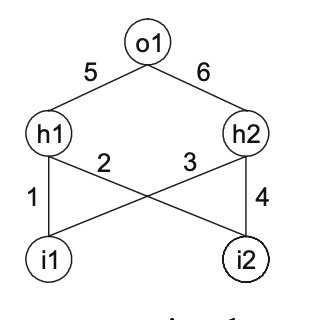
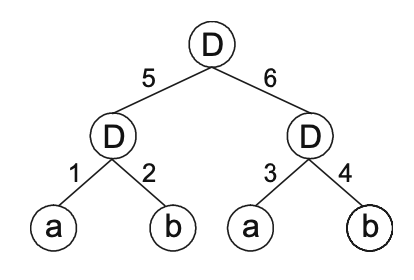

# Design of Neural Networks

- An artificial Neural Network (NN) is a computational device that consists of many simple connected units (neurons) that work in parallel
- Each connection is usually weighted by real valued weights, and they are the primary means of learning in NN, and a learning algorithm is usually used to adjust weights 
- Structurally, a NN has three different classes of units
    - Input units
    - Hidden units
    - Output units 
- An activation pattern is presented on its input units and spreads forward from input layer, through one or more layers of hidden units, and finally to output units 
- Activation of each unit is multiplied by the weight on the links as it spreads, and all incoming activation are added together in a unit, and this becomes activated if the result is above a unit's threshold 
- In summary, basic elements of NN are units, connections between them, weights and thresholds
- We must encode this elements in a linear chromosome in order to simulate fully a NN so that it can adapt in a particular selection environment 
- For that, a special chromosomal organization was created
- Using GEP, we can train (evolve) networks and solve problems like symbolic regression, classification, and logic synthesis   

## Genes with Multiple Domains for NN Simulation 

- Due to the simplicity of GEP, it is possible to fully encode NNs of different sizes and shapes in a linear chromosome of fixed length, and by expressing them, the structures can become fully functional, grow and adapt, and evolve based on fitness, exploring solution landscapes and evolving solutions virtually to all kinds of problems 
- in GEP nets, the network architecture is encoded in the structure of a head/tail domain
- Head contains special functions (neurons) that activate hidden output units (in GEP called functional units), and terminals that represent input units 
- Tail only contains terminals
- Besides head and tail, these genes (NN-Genes) contain two additional domains `Dw` and `Dt`, encoding respectively , weights and thresholds of NN encoded in head/tail domain 
- Structurally, `Dw` comes after tail, and its length `d_w` depends on head size `h` and maximum arity `n_max`, and is evaluated by expression `h * n_max`
- `Dt` comes after `Dw` and has length `d_t` equal to `h`
- Both domains are composed of symbols representing the weights and thresholds of the NN 
- For each NN-gene, weights and thresholds are created at the beginning of each run, but their circulation is guaranteed by usual genetic operators of mutation, inversion, transposition, and recombination
- Furthermore, special mutation operators were created to allow introduction of variation in the set of weights and thresholds 
- Normal genetic operators are not affected, as long as boundaries of each region are maintained, and alphabets of each domain are used correctly within the confines of respective domains 
- As a visual example, consider the following NN, with two inputs `i1` and `i2`, two hidden units `h1` and `h2`, and one output unit `o1`
    - For simplicity, thresholds are all equal to one and omitted 
- 

 
- It can also be represented by a conventional tree
- 

 
- Where `a` and `b` represent two inputs `i1` and `i2`, and `D` represents a function with connectivity two. This function multiplies values of arguments by their respective weight and adds all incoming activation in order to determine forwarded output. The output (0 or 1) depends in threshold. If total incoming activation is equal to or greater than threshold, the output is one, otherwise zero
- We can linearize the above NN-tree as follows
    - `DDDabab123456`
    - where `123456` encodes the weights
    - Values of weights are kept in an array and retrieved as necessary, as numbers represent indexes in the array 

## Special Genetic Operators 

- Efficient evolution of GEP-nets require a special set of genetic operators
- GEA operators can be easily transposed, and all of them can be used as long as boundaries are mantained and alphabets are used within confines of domain 
- Mutation is extended (most important one), but different mutation operators were implemented (head/tail mutation, DW mutation, Dt mutation) so that their roles were understood more easily, and the rate is same for all of them 
- Inversion was also extended, with usual working in head tail, and two others working in new domains 
- IS and RIS transposition operators were also transposed, restricting actions to head and tails, and creating special ones within each new domain 
- Recombination and gene transposition is straightforward, as actions never fix domains or alphabets
- For multigenic systems, a special intragenic two-point recombination was created to restrict the exchange of sequences to a particular gene 
- In addition, special mutation operators were created to introduce modification in set of available weights and thresholds 

### Domain-specific Inversion 

- Similar to inversion operator used in head of genes, but it operates either in Dw or Dt
- These operators randomly choose chromosome, gene with its Dw/Dt, and start and termination point of sequence to be inverted  

### Domain-specific Transposition 

- Transposition restricted to NN-specific domains
- Operator randomly chooses chromosome and gene with its respective Dw or Dt, first and last position of transposon, target site (within Dw or Dt), and it moves transposon from place of origin to target site 

### Intragenic Two-Point Recombination 

- Created to allow modification of a particular gene without interfering with other sub-ons encoded in other genes 
- Same as two-point recombination in basic GEA, with the difference that now recombination points are chosen within a particular gene 
- This allows a greater control of modification mechanism, and permits a much finer tuning of all NN elements
- If we were to use, in multigenic systems, two-point recombination as used in basic GEA (disrupting chromosomes everywhere), the fine adjustment of weights and thresholds would be almost an impossible task 
- Restriction to only one gene ensures that only this gene is modified, and that weights of remaining genes are kept in place 
- Gene recombination is fully operational, and it can be combined with gene transposition to propel evolution with duplicated genes

### Direct Mutation of Weights and Thresholds

- All operators seen before move weights and thresholds around, and this might be more than sufficient to allow an efficient evolution of GEP-NNs with an appropriate number of random weights and thresholds
- However, we can also implement special mutation operators to replace values of a particular weight or threshold
- These operators (called direct mutation of weights and direct mutation of thresholds) randomly select particular targets in arrays where weights/thresholds are kept, and randomly generate new real-valued numbers 
- Consequences of this kind of mutation are diverse
    - Might be neutral if not used
    - Might have manifold effects when it was used more than once in the sub-NN
- Interestingly, if all other operators are used, this kind of mutation seems to contribute very little to adaptation, and better results are obtained when this operator is not used or used at very low rates 
- Thanks to constant restructuring of NN architecture, a well dimensioned initial array of weights and thresholds is more than sufficient to allow evolutionary tuning 
    - If used, we can give a small rate of 0.01 
- Usually arrays of size 10 are enough  

## Solving Problems with GEP Neural Networks 

- To explore GEP-NNs, two problems of logic synthesis were chosen for their importance and simplicity 

### NN for the Exclusive-Or Problem

- XOR is a simple Boolean function of two activities, and it can easily be solved using linearly encoded NNs
- For experiment, functions of 2, 3 and 4 connectivity were used, and an `h = 4`, as this problem has high connectivity 
- This is enough to find lots of perfect solutions for XOR. Some are really complicated, but we can even find solutions more parsimonious that the conventional XOR function 
- Success rate for this problem using a redundant chromosomal organization is higher than a compact organization (`h = 2`), with a 77% rate vs 30% rate
- In second experiment, very parsimonious solutions were found
- Algorithm discovered several solutions for XOR function 

### NN for 6-Multiplexer

- Multiplexers are logic circuits frequently used in communications and input/output operations for transmitting a number of separated signals simultaneously over a single channel
- Task of 6-bit boolean multiplexer decodes a 2-bit binary address and return the value of corresponding data register 
- This experiment was tried with unigenic and multigenic systems
- One of the best solutions in unigenic systems found a solution with 32 nodes
- Solutions foundd in multigenic Nes are structurally more constrained as linking functions need to be chosen (OR was used here)

### Extra notes
- GEP-nets can also solve problems of classification and symbolic regression 
- It can also solve multiple output problems using multigenic or multicellular systems 

## Evolutionary Dynamics of GEP-nets

- NNs described here are perhaps the most complex entities created with GEP
- It turns out, GEP-NN systems exhibit the same kind of dynamics found on other less complex GEP systems
    - It has an oscillatory pattern on average fitness, and best fitness is considerably above average fitness 
- Ubiquity of these dynamics suggests that all healthy genotype/phenotype evolutionary systems are ruled by them 
