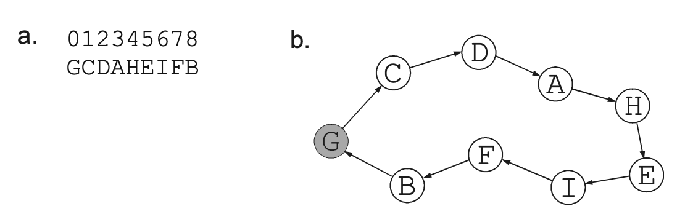
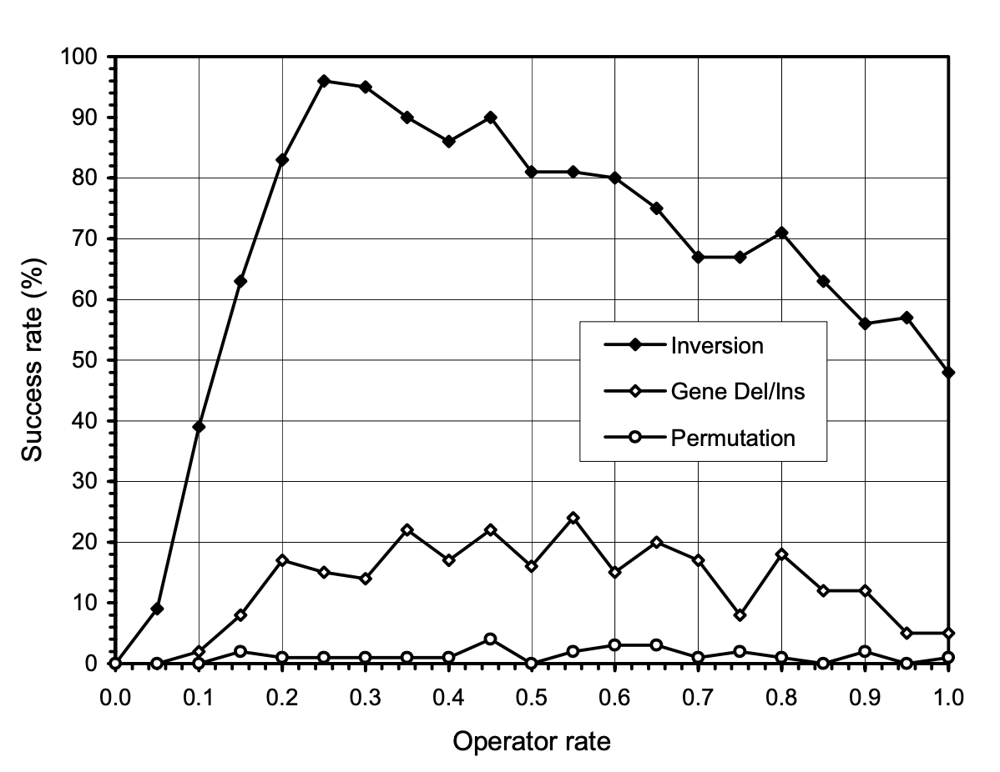
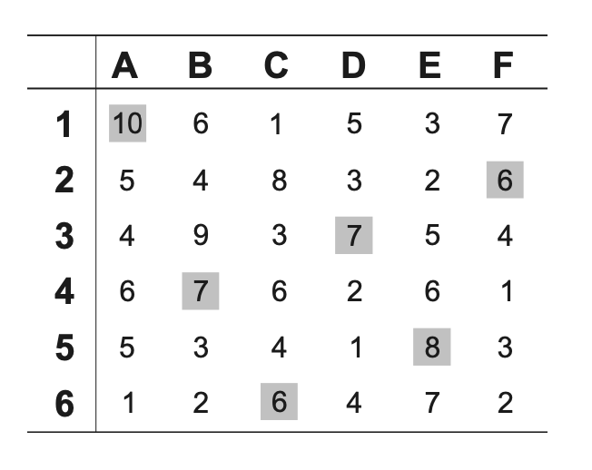

# Combinatorial Optimization 

- In GEP the simplest chromosome will code for a single gene composed of one terminal (obtained when `h = 0`). Tail length would be 1, and gene length would also be 1, all composed by terminals
    - In its simplest representation, GEP is equivalent to a canonical genetic algorithm in which each gene consists of just one terminal 
- In multigenic chromosomes, one-element genes are extremely useful, as the can be organized in multigene families (MGFs)
- These MGFs consist of clusters of related genes encoding a particular class of terminals
    - In MGFs, each gene codes for a particular terminal or task
- This chromosomes composed of MGFs are very useful for evolving solutions to scheduling problems 
- Evolution of such solutions requires special combinatorial-specific operators so that populations of candidate solutions evolve efficiently  

## Multigene Families and Scheduling Problems 

- Multigene families (MGFs) are very useful to find solutions to combinatorial problems as different classes of terminals/items can be organized into different multigene families
- For instance, different cities in the traveling salesman problem (TSP) can be encoded in a multigene gamily, where each gene codes for a city 
- For example, consider the following chromosome, composed of one MGF with nine members 
    - `GCDAHEIFB`
    - where each elements represents one city 
- In this case, expression consists of spatial organization of all the elements, i.e. the orderly way in which they interact with one another
- This kind of chromosomal structure is going to be used in following sections to solve the TSP
-  

 
- For combinatorial problems with `N` classes of terminals, multigenic chromosomes composed of `N` multigene families can be used 
- In task assignment problem used in following sections, a simple six-by-six optimization problem, two multigene families representing two different classes of elements will be used, for instance:
    - `632451EDFCBA`
    - First six elements represent a family
    - Second represent another family 
- Different combinatorial problems require different chromosomal organizations and specification of interactions between mutligene families, but this kind of structure is the basis to encode virtually all kinds of scheduling problems

## Combinatorial-specific Operators : Performance and Mechanisms 

- In these types of problems, elements of a multigene family must all be present and cannot be represented more than once
- Therefore, special modification mechanisms must be created in order to introduce genetic variation in population 
- This section discusses the three most efficient combinatorial-specific genetic operators and the less efficient ones too
- All these operators introduce genetic variation without disrupting balance of multigene families, and therefore always produce valid structures 
- Before proceeding with descriptions, we can compare their performances (using TSP to measure) 
    - Best operator is by far inversion 
    - This is followed by gene deletion/insertion 
    - Restricted permutation is the less efficient 
- 

 

### Inversion 

- Inversion operator randomly selects the chromosome, multigene family to modify, inversion points in MGF, and inverts the sequence between these points 
- Each chromosome can only be modified once by this operator 
    - This operator can invert the whole sequence, or even make a small change like swapping two adjacent elements 
- Most powerful of the combinatorial-specific genetic operators, causing populations to evolve with great efficiency even if used as only source of genetic modification 
    - This operator alone produces better results than when combined gene deletion/insertion or permutation 
- Usually choose inversion rates between 0.2 and 0.6 for good results in most problems 

### Gene Deletion/Insertion 

- Second in importance of combinatorial-specific operators 
- This operator randomly selects chromosome, multigene family, gene to transpose, and insertion site
- Each chromosome can only be modified once by this operator 
- When combined with inversion, it might be useful for finer adjustments
    - However, for all problems in this chapter, performance was better with inversion alone 

### Restricted Permutation 

- Allows two genes occupying any positions within a particular multigene family to exchange positions
- Might be useful for making finer adjustments when combined with inversion, but if used alone, its performance is very poor 
- The operator randomly chooses a chromosome, multigene family and genes to be exchanged 
- Each chromosome can only be modified once by this operator 
- Restricted permutation, if used in small rates, and with inversion, might be useful for finer adjustments. But again, for all problems in this chapter, restricted permutation used with inversion made success rate decrease slightly 

### Other Search Operators 

- There are more combinatorial-specific operators, but compared to inversion, these operators are extremely inefficient
- Nevertheless, analysis of their performance and mechanisms can give us some clues about fundamental attributes that a good combinatorial-specific operator must have 

#### Sequence Deletion/Insertion 

- Similar to gene deletion, but permits transposition of sequences of varied length 
- This might appear more advantageous, but experience shows the opposite, as this operator produces results even worse than restricted permutation operator on TSP 

#### Generalized Permutation 

- Variation of restricted permutation, where a different number of genes in a chromosome can trade places with other genes according to a certain rate 
- Again, this might seem more advantageous, but experience shows that restricted permutation is slightly better  

## Two Scheduling Problems 

- We explore two scheduling problems, the Traveling Salesman Problem, and Task assignment problem
- One requires just one family, other requires two different multigene families 

### The Traveling Salesman Problem 

- TSP represents a classical optimization problem
- For TSP with 19 cities, there are `19! = 1.21645 x 10^17` combinations to search 
- Tour length cannot be used directly as fitness, as shorter solutions are better, so for each generation, the fitness `f` of program `i` in generation `g` is evaluated by
    - `f(i) = T_g - t_i + 1`
    - where `t_i` is length of tour encoded in `i`, and `T_g` is length of largest tour encoded in current population 
- This way, fitness of worst individual of population is always equal to one 
- As usual, we select individuals by roulette wheel selection, and each generation keeps the best individual unchanged 
- Results obtained by GEP for TSP with 19 cities are outstanding if we compare then with GA 
    - GA could not find shortest route with population of 800 on 200 generations
    - GEP finds shortest route with only 100 individuals for 200 generations, and it finds it in practically all runs (96% of runs) 
        - We need to point that only inversion was used 
- Difference comes from the set of genetic operators used 

### The Task Assignment Problem 

- Task Assignment Problem (TAP) is a simple toy problem used in combinatorial cost-optimization problems 
- In TAP, there are `n` tasks that must be accomplished by using only `n` workers
- Each worker performs better at some tasks and worse at others, and obviously, some workers are better than others at certain tasks 
- Goal is to minimize total cost for accomplishing all tasks
- Suppose we have to shelve `n` book collections in a library with `n` shelving assistants, and we want to maximize the rate.
- Each assistant has a rate at which books are shelved per minute for each collection 
    - This is used as input data or fitness case 
- 

 
- On picture above, we show the best assignment, getting a shelving rate of 44 
- For this simple problem we have `6! = 720` possible assignments 
- We can compare performance with this problem, as it uses more than one multigene family 
- Indeed, TAP is solved very efficiently using only inversion as the source of genetic variation, and two multigene families
    - First one to encode the assistants (as numbers)
    - Second one to encode book collections (as letters)
- A valid chromosome could be
    - `652314DECFAB`
- It contains two MGFs, and to express it we assign the first position of each family together, second together, etc
    - In this case we would have 6D, 5E, 2C, 3F, 1A and 4B
- In first successful run, a solution with max fitness was discovered in generation 16, and there was a success rate of 69%
 
