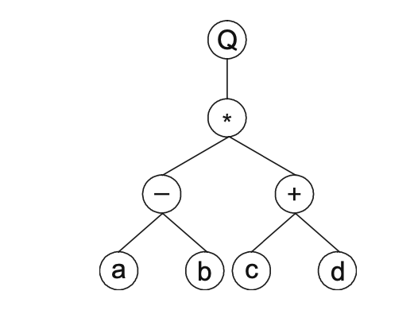

# The Entities of Gene Expression Programming 

GEP gene expression is simple. The main players are only two: The chromosomes and the expression trees. The latteer consisting of the expression of the genetic information encoded in the former 

- The process of information decoding is called translation 
- This translation implies a kind of code and a set of rules
    - This code is very simple, with one to one relationship between symbols of the chromosome and the cuntions and terminals they represent
    - Rules are also simple, they determine the spatial organization of the functions and terminals in the expression trees and the type of interaction between sub-expression trees in multigenic systems
-  This means there are two languages in GEP
    - Language of the genes
    - Language of the expression trees  
- Thanks to the simple rules that determine structure of expression trees and their interactions, it is possible to infer immediately the phenotype (equivalent to folding of a protein) given the sequence of a gene and vice versa
-  Called *Karva* language 

## The Genome

- In GEP, the genome (chromosome) consists of a linear, symbolic string of fixed length, composed of one or more genes. 
    - Despite their fixed length, GEP chromosomes code for expression trees of different sizes and lenghts
- Structure of GEP gene 
    - In GEP, the start site is always the first position of a gene
    - The termination point does not always concide with last position of a gene
- Algebraic expressions can be represented as expression trees (ET)
    - This kind of representation is the phenotype of GEP genes
    - Inferred with straightforward reading from left to right and top to bottom. 
    - *Q*-+abcd* maps to a function *Q((a - b) * (c + d))*
    - The expression tree would look like:
    - 
 - The expressions used are called *K-expressions* from *Karva* language
