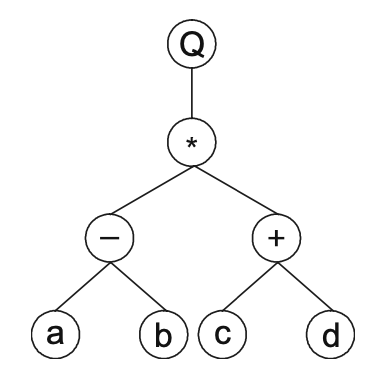

# The Entities of Gene Expression Programming 

GEP gene expression is simple. The main players are only two: The chromosomes and the expression trees. The latteer consisting of the expression of the genetic information encoded in the former 

- The process of information decoding is called translation 
- This translation implies a kind of code and a set of rules
    - This code is very simple, with one to one relationship between symbols of the chromosome and the cuntions and terminals they represent
    - Rules are also simple, they determine the spatial organization of the functions and terminals in the expression trees and the type of interaction between sub-expression trees in multigenic systems
-  This means there are two languages in GEP
    - Language of the genes
    - Language of the expression trees  
- Thanks to the simple rules that determine structure of expression trees and their interactions, it is possible to infer immediately the phenotype (equivalent to folding of a protein) given the sequence of a gene and vice versa
-  Called *Karva* language 

## The Genome

- In GEP, the genome (chromosome) consists of a linear, symbolic string of fixed length, composed of one or more genes. 
    - Despite their fixed length, GEP chromosomes code for expression trees of different sizes and lenghts
- Structure of GEP gene 
    - In GEP, the start site is always the first position of a gene
    - The termination point does not always concide with last position of a gene
- Algebraic expressions can be represented as expression trees (ET)
    - This kind of representation is the phenotype of GEP genes
    - Inferred with straightforward reading from left to right and top to bottom. 
    - *Q*-+abcd* maps to a function *Q((a - b) * (c + d))*
    - The expression tree would look like:
    - 
 - The expressions used are called *K-expressions* from *Karva* language (also referred to as ORFs)
 - Another example of a *K-expression" is:
     - *Q*b**+baQba* 
     - 
 - Tree was filled as indicated. Left to right, top to bottom, only filling non terminal nodes with number of params required
- In GEP, there is no such thing as an invalid expression or computer program
- This structure is simple and elegant, but in the context of a gene, it has other advantages
    - Length of GEP genes is fixed, so on GEP what varies is the length of the ORFs.
    -  Sometimes lenghts are the same, but as we said earlier, end points do not always concide, which leaves us with noncoding regions at the end of the gene. 
- This noncoding regions are the essence of GEP and evolvability 
    - They allow the modification of the genome through the use of virtually any kind of genetic operator without restrictions, always producing syntactically correct programs
    - This oprens new grounds of exploration of search space 
    - This fundamental property is called syntactic closure
- This is the main difference between GEP and previous GP implementations

### Organization of Genes
- Composed of two different domains: head and tail domain, each with difrerent properties and functions
- Head domain
    - Used to encode the functions chosen for the problem at hand  
    - Contains symbols that represent both functions and terminals
- Tail Domain
    -  Works as buffer or reservoir of terminals in order to guarantee the formation of only valid structures
    -  Composed of only terminals
- For each problem, a length *h* for the head is chosen
- Length of tail is a function of *h* and the number of arguments of the function with more arguments *n_max* (called maximum arity)
    - t = h * (n_max - 1) + 1
- Both this parameters generate the length of the gene *g* 
- With this, we make sure the genome is always valid, as we can use the buffer to fill out parameter terminals whenever needed. 
    - An example of this would be to have *h* = 4 with operations { + and - }. Here, *n_max* is 2, so *t* =  5. Then *g* = 9
     - With a gene *+ab-abbab*, we have the evaluation of *(a + b)*. Note how, even with *h = 4*, we only use 3 nodes. So the gene length is 9, but the ORF has length 3
     - With a gene *++++aaaaa*, we get *(((a + a) + a) + (a + a))*. Even in a worst case where all our head spaces are filled with the max parameter operation, we have enough buffer space to finish the expression into a valid one     
- Despite their fixed length, each gene has the potential to code for expression trees of different sizes and shapes, from only one terminal node, to one composed of *g* nodes
- If we always mantain the boundaries between head and tail and their rules, it is easy to see that we will always get a valid expression 

### Multigenic chromosomes
- In nature, chromosomes usually code for more than one gene
- The evolution of more complex entities is only possible through the creaetion of multigenic genomes
- GEP also explores the advantages of multigenic systems
- Chromosomes of GEP are usually composed of more than one gene on equal length
    - The number of genes and length of head is usually chosen a priori
- Each gen codes for a sub-ET, and the sub-ETs might interact with one another, forming a more complex entity   
- We can make a big chain with all genomes. If we know *h* and *t*, it is easy to know where each genome starts, so we have a clear separation.
    - On a multigenic chromosome with *h* = 3, and *t* = 4
    - chromosome is *+++aaaabbbbaaa+abbaba*
    - The length is 21, so if we know *g* = 7, then we know we have 3 genes
    - Each gene has a length of 7, even if the evaluation is shorter
    - So each gene would be *+++aaaa*, *bbbbaaa*, and *+abbaba*  
    - Each ET has length 7, 1 and 3

## Expression Trees and Phenotype  

- GEP chromosomes can have different structural organizations, which leads to different degrees of complexity on the individuals encoded in each one. 
- Simplest one we have encountered is encoded in a single gene, and the "organism" is the product of one gene, an ET composed of one subunit. 
- In other cases the "organism" is a multi-subunit ET in which different subunits are linked together by a particular linking function, or other case where the "organism" is composed of different sub-ETs, in which each each one is responsible for a particular facet of the problem.  
- This leads to different levels of phenotypic complexity that will be explored in this section

### Information Decoding: Translation
- All GEP programming starts with translation, which represents the construction of all the sub-ETs. 
- When genome codes for more than one gene, each gene is independently translated as a sub-ET, wich can be linked to others, or work togheter with others without direct connections between them. 
    - For example, a chromosome with three genomes generates three different sub-ETs. 
    - Usually, each sub-ET is part of a bigger program in which they are linked by a particular linking function 
    - For those chromosomes, the expression of genetic information starts with translation of sub-ETs, but ends only after linking by the linking function 
    - Therefore, the "organism" will consist of a multi-subunit ET, composed of three smaller subunits
    - In multiple output problems, each genome works in identifying of one kind of output. They are not physically connected, but they work together for identification, like in classification problems. 

### Posttransational Interactions and Linking Functions
- For algebraic expressions, usually addition, substraction, multiplication or division is chosen to link the sub-ETs
- For boolean expressions, linking functions usually use NOR, LT, GT, XOR, NAND, AND, NXOR, LOE, GOE and OR. Also functions with three arguments like IF THEN ELSE.
- Easiest linking is with functions taking two arguments, as any number of sub-ETs can be linked one after another. 
- Linking functions of more than two arguments, say `n`, is more problematic, as it requires `n^n` sub-ETs for correct linking. 
