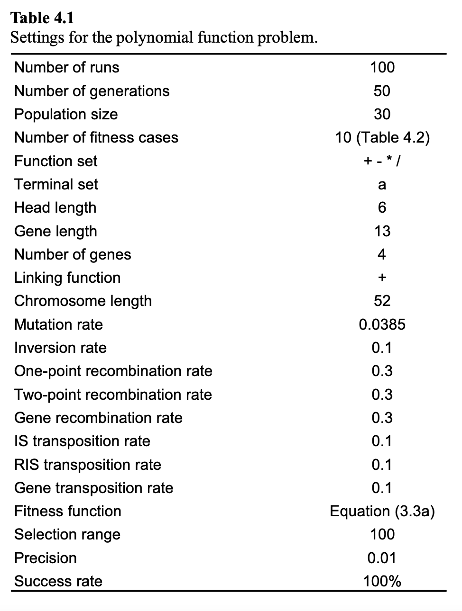
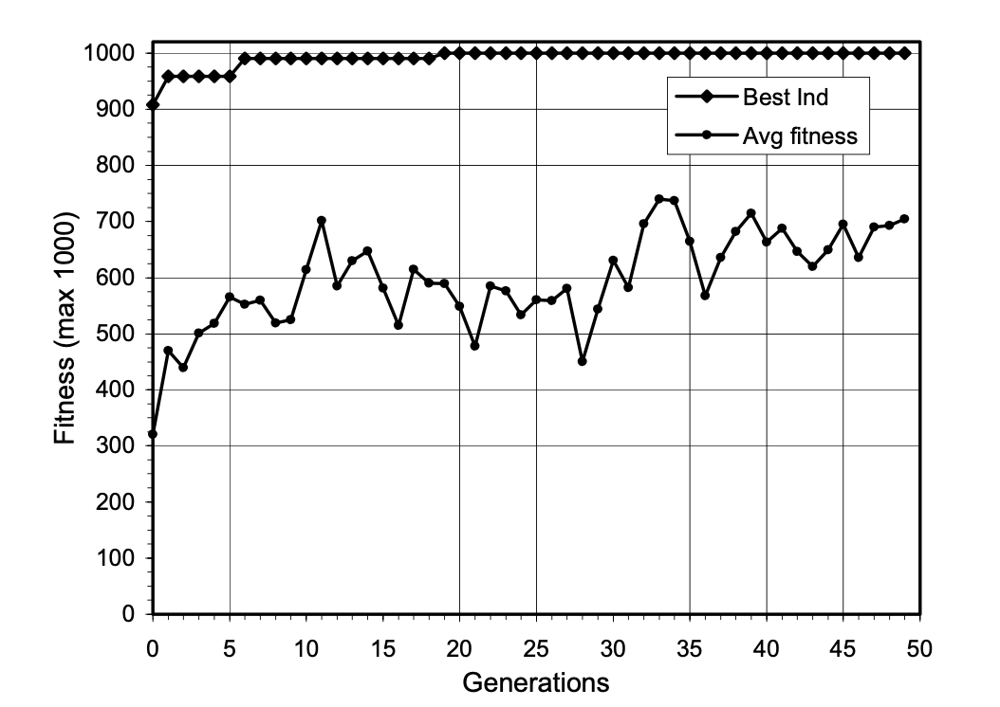

# The Basic GEA In Problem Solving
- This chapter explores how a basic GEA can be used to solve complex problems from very different fields, how can GEP be used to find cheap solutions, and how to enrich the evolutionary toolkit of GEP through use of user defined functions to design parsimonious(cheap) solutions to complex modular functions using smaller building blocks

## Symbolic Regression

- Will analyze complex problems of symbolic regression to evaluate performance of algorithm
    - First is a simple test function that can be exactly solved by basic GEA, which will help show the importance of fundamental parameters of the algorithm, such as population size, number of generations, fitness function, chromosome size, number of genes, head size and linking function 
    - Second consists of complex test function with five arguments that shows how GEP can be efficiently applied to model complex realities with great accuracy
    - Third is to illustrate how GEP can be efficiently used for mining relevant information from noisy data

### Function Finding on a One-Dimensional Parameter Space

- Target function of this section is a simple cubic polynomial 
    - `y = a^3 + a^2 + a + 1`
- Parameters chosen for this problem are shown below, how and why is discussed below  
- 

- Parameters
    - Set of functions was chosen to be just basic arithmetic operators for sake of simplicity, giving `F={+, -, *, /}`
    - Terminals set will include just the independent variable, giving `T={a}`
    - For structural organization, it is wise to start with short simple-gene chromosomes and gradually increase `h`
        - Success rate increases as `g` increases, and then it starts to decrease progressively
        - For each problem, it is possible to guess more or less accurately the ideal head length 
        - Gap can be used to search for cheaper solutions by choosing smaller and smaller head sizes 
        - In this case, `h` of 6 was the smallest head that achieved a perfect solution, so a chromosome of length 13 was chosen
        - Sometimes, a certain redundancy is fundamental to the efficient evolution
    - A population size `P` of 30 individuals was used 
        - Important in terms of evolution and processing time
        - Using huge populations in GEP is not always necessary, as small populations of 20-100 individuals can evolve efficiently too 
    - Usually, multigenic is lot more efficient than unigenic but there is a limit too, as too many genes can be counterproductive 
    - Generations can adapt and evolve indefinitely with all the genetic variations, but trying to prolong evolution in lots of generations is unnecessary, as in later generations, not much genetic diversity remains
    - Lastly, if multigenic systems with sub-ETs linked by addition do not evolve correctly, we can choose another linking function, or let the system evolve the linking on its own by choosing a cellular system 
- Typically, one usually experiments with a couple of chromosomal organizations and tests different function sets, and by observing best and average fitnesses, it is easy to see whether the system is evolving efficiently or not 
- After choosing the appropriate settings, one just lets system evolve the best possible solution on its own 
- We can see the runs of the problem with parameters selected shown below:
- 

In summary
- GEP is very flexible and has easily navigable solution spaces 
- Usually, default settings can be used to solve most problems, needing small adjustments here and there to make the most out of them 
- Thus, small populations of 30 individuals, evolving as long as they never become stagnant , undergoing a typical degree of genetic modification is a good start
- A typical chromosome architecture of three genes with `h` = 10, linked by addition and a function set of basic arithmetic plus sqrt(), exp(), ln() to spice them a bit, and a standard fitness function as mean squared error is also a good place to begin with problems in symbolic regression 

### Function Finding on a Five-dimensional Parameter Space 

- The goal of this section is to show how GEP can be used to model complex realities with high accuracy. 
- The test function chosen is the following 5-param function 
    - 

    - where `a`, `b`, `c`, `d`, and `e` are independent variables, and `exp` is Euler's number
 

