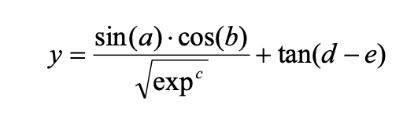

# The Basic GEA In Problem Solving
- This chapter explores how a basic GEA can be used to solve complex problems from very different fields, how can GEP be used to find cheap solutions, and how to enrich the evolutionary toolkit of GEP through use of user defined functions to design parsimonious(cheap) solutions to complex modular functions using smaller building blocks

## Symbolic Regression

- Will analyze complex problems of symbolic regression to evaluate performance of algorithm
    - First is a simple test function that can be exactly solved by basic GEA, which will help show the importance of fundamental parameters of the algorithm, such as population size, number of generations, fitness function, chromosome size, number of genes, head size and linking function 
    - Second consists of complex test function with five arguments that shows how GEP can be efficiently applied to model complex realities with great accuracy
    - Third is to illustrate how GEP can be efficiently used for mining relevant information from noisy data

### Function Finding on a One-Dimensional Parameter Space

- Target function of this section is a simple cubic polynomial 
    - `y = a^3 + a^2 + a + 1`
- Parameters chosen for this problem are shown below, how and why is discussed below  
- 

- Parameters
    - Set of functions was chosen to be just basic arithmetic operators for sake of simplicity, giving `F={+, -, *, /}`
    - Terminals set will include just the independent variable, giving `T={a}`
    - For structural organization, it is wise to start with short simple-gene chromosomes and gradually increase `h`
        - Success rate increases as `g` increases, and then it starts to decrease progressively
        - For each problem, it is possible to guess more or less accurately the ideal head length 
        - Gap can be used to search for cheaper solutions by choosing smaller and smaller head sizes 
        - In this case, `h` of 6 was the smallest head that achieved a perfect solution, so a chromosome of length 13 was chosen
        - Sometimes, a certain redundancy is fundamental to the efficient evolution
    - A population size `P` of 30 individuals was used 
        - Important in terms of evolution and processing time
        - Using huge populations in GEP is not always necessary, as small populations of 20-100 individuals can evolve efficiently too 
    - Usually, multigenic is lot more efficient than unigenic but there is a limit too, as too many genes can be counterproductive 
    - Generations can adapt and evolve indefinitely with all the genetic variations, but trying to prolong evolution in lots of generations is unnecessary, as in later generations, not much genetic diversity remains
    - Lastly, if multigenic systems with sub-ETs linked by addition do not evolve correctly, we can choose another linking function, or let the system evolve the linking on its own by choosing a cellular system 
- Typically, one usually experiments with a couple of chromosomal organizations and tests different function sets, and by observing best and average fitnesses, it is easy to see whether the system is evolving efficiently or not 
- After choosing the appropriate settings, one just lets system evolve the best possible solution on its own 
- We can see the runs of the problem with parameters selected shown below:
- 

In summary
- GEP is very flexible and has easily navigable solution spaces 
- Usually, default settings can be used to solve most problems, needing small adjustments here and there to make the most out of them 
- Thus, small populations of 30 individuals, evolving as long as they never become stagnant , undergoing a typical degree of genetic modification is a good start
- A typical chromosome architecture of three genes with `h` = 10, linked by addition and a function set of basic arithmetic plus sqrt(), exp(), ln() to spice them a bit, and a standard fitness function as mean squared error is also a good place to begin with problems in symbolic regression 

### Function Finding on a Five-dimensional Parameter Space 

- The goal of this section is to show how GEP can be used to model complex realities with high accuracy. 
- The test function chosen is the following 5-param function 
    - 

    - where `a`, `b`, `c`, `d`, and `e` are independent variables, and `exp` is Euler's number
- We could use the mean squared error as fitness function 
- We can choose some specific points to evaluate fitness, but this would represent a small part of the problem domain. 
- To solve this, we can use a testing set, not used during learning, and checked after to evaluate the usefulness of the model and its capabilities 
    - Usually we use 30-35% of samples for testing 
- The domain for this problem has
    - Basic arithmetic functions, sqrt(x), exp(x), sin(x), cos(x), tan(x), that can be represented by symbols Q, E, S, C, T, getting then `F = {+, -, *, /, Q, E, S, C, T}`
    - Terminals consist of independent variables `T = {a, b, c, d, e}`
    - Two genes will be used per chromosome, each with length 12 and sub-ETs of length of maximum 25 nodes each
    - Sub genes linked by addition. 
- Using this over 5000 generations, results got the best solution fitness of 999.992. 

### Mining Meaningful Information from Noisy Data

- Quantity of data is so big that to find meaningful factors becomes a difficult task 
- With GEP, we can extract relevant knowledge from these huge data bases 
- For example, in a function where 9 out of ten variables are meaningless, GEP can find solutions that avoid the use of the meaningless variables

## Classification Problems 

- In this section, we used GEP to model complex real-world problems, as diagnosis of breast cancer, assignment of a credit car, and classification of Fisher's irises

### Diagnosis of Breast Cancer

- Goal to classify a tumor as benign or malignant based on nine different cell analysis (input attributes), like clump thickness, uniformity of cell size, uniformity of cell shape, marginal adhesion, single epithelial cell size, bare nuclei, bland chromatin, normal nucleoli and mitoses
- Model where binary `1-of-m` encoding in which each bit represents one of the `m` possible output classes, was replaced by a 1-bit encoding (0 for benign, 1 for malignant)
- Used 350 samples for training and 174 for testing
- Boolean functions added to `F` set, like `LT, GT, LOE, GOE, ET, NET`, that return a boolean value if true or false (greater than, less than, equal, etc)
- Terminals representen by each on the nine input attributes 
- In classification problems where output is often binary, it is important to set criteria to convert predicted values (real-values) into zero or one 
- Uses a rounding threshold `R`, it equals to 1 if value is bigger or equal than `R`, 0 otherwise
    - Usually uses 0.5
- We use a fitness equation with sensitivity and specificity 
- In one run, a very good solution of 957.08 was obtained, with classification error of 2.571%. 
- Using Software, expressions created by this run can be exported to programs like C++
- With this run, some inputs were found to be not that relevant (a big advantage of GEP), as we can extract knowledge

### Credit Screening 

- Goal of credit screening is to determine whether to approve or not a customer's request for a credit card. 
- Uses 51 input attributes, and uses a replacement by a 1-bit encoding (as we did before)
- In one run, by generation 11,446 a solution with classification error of 10.14% and accuracy of 89.65% was created 
- Again, only 25 of 51 attributes are used on the final solution, so we extract extra knowledge 

### Fischer's Irises

- Goal to classify three different types of irises based on four measurements: sepal length, sepal width, petal length and petal width
- It has more than two classes of classification
- To solve problems of `n` classes, there are two different approaches in GEP
    - Decomposing data into `n` separate 0/1 classification problems
    - Use Multigenic nature of GEP to solve problems of multiple outputs in one go. That is, chromosomes composed of `n` different genes are used to design `n` different sub-models, where each sub-model is responsible for the identification of a particular class
- Second approach is appealing and GEP system is indeed very efficient at solving problems of this kind 
- However, for problems with 10 classes or more, or more than 50 attributes, first approach can be more time consuming, but better choice, as it is much more flexible in structure and composition 

#### Decomposing a Three-class Problem 

- Classification of data into `n` distinct classes `C` require processing data into `n` separate 0/1 problems as follows:
    - `C_1 vs NOT C_1`
    - `...`
    - `C_n vs NOT C_n`
- `n` different sub-models are evolved separately and afterwards combined to create final model 
- Then using each model, and when only one is recognized, we get a model with accuracy of 99.33%

## Logic Synthesis and Parsimonious Solutions 

- Section to analyze different kind of symbolic regression, one used in design of logical functions, that is connected with finding the most parsimonious solution to a problem 
    - This is crucial to create faster machines 

### Fitness Functions with Parsimony Pressure

- When evolving systems, one needs to be careful with the balance between parsimony and optimization
    - If we try to optimize solutions based on efficiency and size too, we can hinder evolution by applying too high a pressure on parsimony 
- On logic synthesis we can have both, by using big solutions to find an optimal one, and then start selecting solutions based on size 
    - We unconstrained the look for perfect solutions, and then we apply pressure on size 
- To design a fitness function with parsimony pressure, we must distinguish raw fitness from overall fitness 
- Raw fitness involves functions like # of hits, sensitivity/specificity, PPV and NPV 
- To add parsimony pressure, we can evaluate the following formula 
    - `f(i) = rf(i) * (1 + 1/5000 + (S_max-S_i) / (S_max - S_min))`
    - where `S_i` is size of program, `S_max` and `S_min` represent max and min program sizes, and are evaluated by formulas:
    - `S_max = G(h + t)`
    - `S_min = G`
    - where `G` is number of genes, and `h` and `t` are head and tail sizes

### Universal Logical Systems

- Universal logical system is any set of logical functions that can be used to describe any other logical function 
- Most famous is the classical Boolean system of `{NOT, AND, OR}`
    - It is extremely convenient, as we also think in terms of ANDs, Ors, and NOTs
    - It is quite redundant, as it is possible to describe any logical function using just NOTs and ANDs, or NOTs and ORs
- If we create a system with ANDs, NOTs, plus another function like XOR, it will also be a universal logical system 
    - This system exists, and it is called the Reed-Muller system 
- An `ULM` is a Universal Logical Module
    - It is composed of one basic function plus any combination of simple units `{NOT, 0, 1}`
- There are four well studied ULMs
    - `{AND, NOT}`
    - `{OR, NOT}`
    - `{NAND}`
    - `{NOR}`
    - There are other less studied UMLs that use stuff like LT, GT, etc
- `NAND/NOR-like module` (NLM)
    - `{NAND}` and `{NOR}` systems are special as they don't require any other element (inverter, 0 or 1) to describe any other logical function 
    - Only two that are ULMs in functions with two arguments
- Among three argument functions, there are 56 NLMs

#### NAND Logic 
- NAND system is arguably the most important in industry, as most digital circuits are built using NAND gates
- It finds solution to any logical system, without using any other element, neither one or zero. 
- Its attractiveness resides not on its compactness (Reed-Muller is much ore compact), but on the fact that just one fate can be used to realize any kind of logical function
    - This, in practical terms, is a great advantage
- Creating parsimonious solutions using just NAND (or NOR) is not as intuitive as using classic Boolean functions 
    - Most NAND circuits are designed initially with ANDs, ORs, NOTs, and later converted into NAND circuits with De Morgan's theorems 

#### NOR Logic

- NOR system is, after NAND, second most important in industry
    - Some claim it is better, as it has more compact solutions for some functions 
    - Of course, the opposite is also true 
- Both NOR and NAND are very similar
- Sometimes, using one over another might have drastic consequences in processing time 
- On 2-input functions, both NOR and NAND end up with 84 nodes
- On 3-input functions, NAND system performs slightly better with 150 nodes, against 158 from NOR

#### Reed-Muller Logic

- Reed-Muller System (`{AND, XOR, NOT}`) has a wide variety of applications in the industry, where this system improves processing time 
    - In this study, this system surpasses all others in terms of compactness 
- For 2-input functions, it uses 43 nodes, and 3-input requires 69 nodes

#### MUX Logic

- MUX System is becoming popular due to new emerging technology of programmable gate arrays (FPGAs)
    - Advantage is that one is no longer restricted to usual NAND or NOR gates, as virtually any kind of Universal logical system can be used to build logical circuits 
- `{MUX, NOT}` and `{MUX, 0, 1}` are both universal
- It uses 134 nodes to describe all functions (2-input and 3-input)

### Using User Defined Functions as Building Blocks 

- Sometimes finding a good parsimonious representation to a complex function is hard, and the only way around is trying to explore some pattern it its definition 
- GEP can be used not only to discover patterns in logical functions, but also to integrate these building blocks in designing more complex functions 
- GEP has two ways of designing more complex functions with smaller building blocks
    - First one is automatic, and system not only discovers the building blocks, but also uses them immediately to build more complex solutions 
    - Second is more prosaic and involves the well-known technique of using user defined functions `UDFs`
- In GEP, UDFs may represent functions of several variables, but their rarity is equal to zero 
    - That means, UDFs behave like leaf nodes or terminals 
    - Implementation can be done using UDFs only on head (as function), or both in head and tail (as terminal)
    - This is a matter of taste, as it behaves similarly 
    - Usually used as function
- Using a UDFs fixes the arguments used by the function, instead of taking them from the gene 
- They are extremely useful, specially if they are carefully crafted to the problem at hand, as they can help discover patterns in modular functions 
- Problems will be analyzed to illustrate this point

#### Odd-parity Functions 

- When expressed in binary, a number is said to have odd-parity if it has an odd number of 1s
- Odd-parity functions return 1 of an n-bit number is odd, 0 otherwise 
    - Identity is odd-1-parity function
    - XOR is odd-2-parity function 
- If we tried to solve this with GEP, and just ANDs ORs and NOTs, we would find these functions are really hard to design, and it is almost impossible to find a perfect solution to higher order parity functions 
    - To solve odd-3 or odd-4, it is really difficult for GEP to find a good solution with this approach 
- An alternative is to find a pattern and use it to design all functions we need 
- We could try to use XOR as a UDF to solve odd-3 in order to find if there is a pattern
- Doing this, we get an increase in performance, getting higher success rates and less generations 
- This happens any time a lower order odd-parity function is used as a UDF to design a higher order function 
    - This means there is a pattern we can explore to find good solutions 
    - In this case, we can do an xor using the UDFs and last bit 

#### Exactly-one-on Function 

- series of n-exactly-one-on functions also begins with the identity functions and XOR
- on 3-exactly, similarity ends, as it is very different, and if we want to look for a pattern we must study up again while using Lowe order as UDFs
- Possibilities are immense for candidate solutions to get out of local optima 
- Not even using XOR a perfect solution was found for 9-exactly 
- Using lower order as UDFs, we get a much higher better performance 

