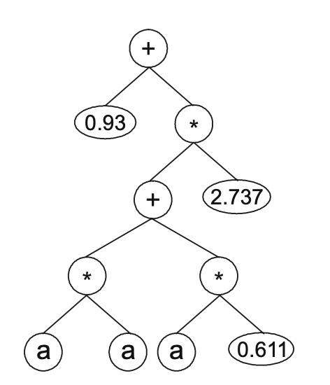

# Numerical Constants and GEP-RNC Algorithm 

- Numerical constants are an integral part of most mathematical models, so it is important to allow their integration in the models designed by evolutionary techniques 
- This chapter discusses different methods of handling numerical constants in GEP

## Handling Constants in Automatic Programming 

- Creating of floating point constants are necessary to design mathematical models using evolutionary techniques 
- Most techniques use simple approach of using a fixed set of numerical constants that are added to the terminal set 
- There is a technique for handling Random Numerical Constants (`RNC`s) in genetic programming 
- GEP solves problem of constants creation using an extra terminal `?` and an extra domain `Dc`, composed of symbols chosen to represent the RNCs. 
- For each gene, the RNCs are generated during the inception of initial population and kept in an array
    - Values of each random constant are only assigned during gene expression 
- A special operator is used to introduce genetic variation in available pool of random constants, by mutating random constants directly
    - Dc-specific inversion and Dc-specific transposition guarantee effective circulation of random constants in the population 
- When algorithm itself is used to create small integer constants from scratch, performance is much better than cases where constants are hand made

## Genes with Multiple Domains to Encode RNCs

- To handle RNCs we can add a new domain, in addition to head and tail, called `Dc` domain
- Dc domain is created to handle random numerical constants and it has an extremely elegant, efficient and original way of dealing with them 
- Structurally, `Dc` comes after the tail, has a length equal to `t`, and is composed of symbols used to represent random numerical constants 
   - Therefore, another region with defined boundaries and its own alphabet is created in the gene 
- For each gene, the numerical constants are randomly generated at the beginning of the run, but circulation is guaranteed by usual general genetic operators and `Dc-specific` genetic operators that guarantee  a more generalized shuffling of numerical constants

- As an example, consider the following gene with `h` = 7
    - `+?*+?**aaa??aaa68083295`
    - `68083295` represents the `Dc`
    - The terminal ´?´ represents the random numerical constant 
    - The `?`s in the ET are replaced from left to right and from top to bottom by the symbols (numerals for simplicity) in the Dc. 
- Values corresponding to these symbols are kept in an array, and for simplicity, the numbers represented by the numericals indicate the order of array. 
- As an example, for the given chromosome above, we would get the following ET
- 

 
- Genes encoding this type of domain can be used to great advantage in polynomial induction and parameter optimization 
- We can usually use values in range [-2, 2]

## Multigenic Systems with RNCs

- To create multigenic systems in which the basic units ara the complex genes of previous section is very easy 
- Each gene encodes a different sub-ET and that sub-ET can then be post transitionally linked by a linking function 
- An example of a valid multigenic gene, is 
    - `-//--?a?aa?313500/-*a-???a?a185516`
    - each gene has its own array of numerical constants 
- This GEP-RNC system is considerably more complex that basic GEA. However, this system performs with great efficiency still, so much that it can be used as the basis for more complex systems that require swift handling of huge quantities of random numerical constants

## Special Search Operators for Fine-Tuning the RNCs

- Efficient evolution of this complex entities, requires a special set of genetic operators
- Basic GEA operators are easily transposed to the GEP-RNC system, maintaining boundaries of each domain, and different alphabets must be used within the limits of corresponding domains 

### Dc-Specific Mutation 

- Usually uses same mutation rate for head/tail domains and dc domain
- One could simply extend basic mutation operator to Dc domain
- Chooses a point to change into another RNC 
    - What changes is the index of RNC chosen, not the value of the RNC itself 
    - For example, a 2 changing to 0 would mean use number in position 0 instead of position 2
- Dc region can also have noncoding sequences at its end 

### Dc-Specific Inversion 

- Similar to inversion operator that works in head of genes, but restricted to Dc domain. 
- Randomly chooses a chromosome and a gene, and a start and termination point of sequence (in boundaries of Dc domain).
- Typically, a small inversion rate (0.1) is used 

### Dc-Specific Transposition

- Similar to IS transposition that operates in head/tail domains, but restricted to Dc domain
- Randomly chooses chromosome, gene, start and termination point of transposon, target site, and it moves the transposon from place of origin to target site (all in limits of Dc)
- Typically uses a small rate of 0.1 

### Direct Mutation of RNCs

- Past mutations move RNCs around
- We can implement a special mutation operator that replaces the value of a particular numerical constant by another 
- Randomly selects particular targets in the arrays where RNCs are kept, and randomly generates a new numerical constant 
- Seems to have very limited impact on creation of good models and better results are indeed obtained when the operator is switched off 
- We conclude that a well-dimensioned initial diversity of RNCs is more than sufficient to allow evolutionary tuning, as they are constantly moved around by genetic operators
- Usually use array length of 10 RNCs for Dc less or equal to 20. 
    - For large Dc domains we could increase elements, but even for bigger structures, array of 10 seems to be more than enough 

### Performance 

- Sometimes, inclusion of numerical constants in evolutionary toolkit can result in worse performance 
    - When required constants to solve a problem are small integer constants, evolutionary algorithms find these constants more easily with no a-priori assumptions, as they can create small constants from scratch (like n/n = 1) 
- Even with better performance without them, some solutions might be slightly worse on the long run without GEP-RNC

### Conclusion
- Before starting modeling process, it is advisable to inquire if numerical constants are essential to design good models
- When answer is negative, go with simpler system without numerical constants 
    - It allows faster evolution, and allows creation of more and better programs in record time
- If answer is affirmative, GEP-RNC should be used, as it provides ideal tools for designing extremely accurate models with numerical constants 

